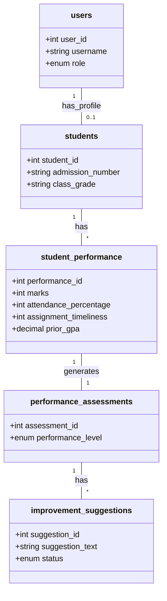

# Database Design for Student Performance Assessment System

## 1. Database Name
**Name:** `student_performance_db`

## 2. Table Overview
The system requires 5 main tables to manage users, student data, academic records, ML assessments, and improvement suggestions.

| Table Name | Description |
| :--- | :--- |
| **users** | Stores login credentials and roles for Admin, Teachers, and Students. |
| **students** | Stores profile details of students. Linked to a user account. |
| **student_performance** | Stores marks, attendance, assignment data, and GPA. **(Input for ML Model)** |
| **performance_assessments** | Stores the ML model's output (Low/Medium/High) and analysis date. |
| **improvement_suggestions** | Stores personalized actions generated based on the assessment. |

---

## 3. Detailed Schema & SQL Queries

### A. Users Table
Stores system authentication data.
*   **Primary Key:** `user_id`
*   **Roles:** Admin, Teacher, Student

```sql
CREATE TABLE users (
    user_id INT AUTO_INCREMENT PRIMARY KEY,
    username VARCHAR(50) NOT NULL UNIQUE,
    password_hash VARCHAR(255) NOT NULL,
    email VARCHAR(100) UNIQUE,
    role ENUM('Admin', 'Teacher', 'Student') NOT NULL,
    created_at TIMESTAMP DEFAULT CURRENT_TIMESTAMP
);
```

### B. Students Table
Stores student-specific personal information.
*   **Primary Key:** `student_id`
*   **Foreign Key:** `user_id` (Links to `users` table)

```sql
CREATE TABLE students (
    student_id INT AUTO_INCREMENT PRIMARY KEY,
    user_id INT,
    admission_number VARCHAR(20) NOT NULL UNIQUE,
    first_name VARCHAR(50) NOT NULL,
    last_name VARCHAR(50) NOT NULL,
    date_of_birth DATE,
    class_grade VARCHAR(10),
    FOREIGN KEY (user_id) REFERENCES users(user_id) ON DELETE SET NULL
);
```

### C. Student Performance Records (ML Input Data)
Stores the raw data required by the Machine Learning model.
*   **Primary Key:** `performance_id`
*   **Foreign Key:** `student_id` (Links to `students` table)
*   **Note:** `marks`, `attendance_percentage`, `assignment_timeliness`, `participation_score`, and `prior_gpa` are the features for the ML model.

```sql
CREATE TABLE student_performance (
    performance_id INT AUTO_INCREMENT PRIMARY KEY,
    student_id INT,
    subject VARCHAR(50),
    marks INT,
    attendance_percentage INT,
    assignment_timeliness INT,
    participation_score INT,
    prior_gpa DECIMAL(3,2),
    semester VARCHAR(20),
    institution_type VARCHAR(10) DEFAULT 'school',
    created_at TIMESTAMP DEFAULT CURRENT_TIMESTAMP,
    FOREIGN KEY (student_id) REFERENCES students(student_id) ON DELETE CASCADE
);
```

### D. Performance Assessments (ML Output)
Stores the results generated by the ML model.
*   **Primary Key:** `assessment_id`
*   **Foreign Key:** `performance_id` (Links to the specific performance record analyzed)

```sql
CREATE TABLE performance_assessments (
    assessment_id INT AUTO_INCREMENT PRIMARY KEY,
    student_id INT,
    performance_id INT,
    performance_level ENUM('Slow Learner', 'Average Learner', 'Fast Learner') NOT NULL,
    confidence_score FLOAT, -- Optional: Probability score from ML model
    assessment_date TIMESTAMP DEFAULT CURRENT_TIMESTAMP,
    FOREIGN KEY (student_id) REFERENCES students(student_id) ON DELETE CASCADE,
    FOREIGN KEY (performance_id) REFERENCES student_performance(performance_id) ON DELETE CASCADE
);
```

### E. Improvement Suggestions
Stores specific actions recommended for the student.
*   **Primary Key:** `suggestion_id`
*   **Foreign Key:** `assessment_id` (Links to the specific assessment)

```sql
CREATE TABLE improvement_suggestions (
    suggestion_id INT AUTO_INCREMENT PRIMARY KEY,
    assessment_id INT,
    suggestion_text TEXT NOT NULL,
    status ENUM('Pending', 'In Progress', 'Completed') DEFAULT 'Pending',
    FOREIGN KEY (assessment_id) REFERENCES performance_assessments(assessment_id) ON DELETE CASCADE
);
```

## 4. Entity Relationship Diagram (ERD) Representation


